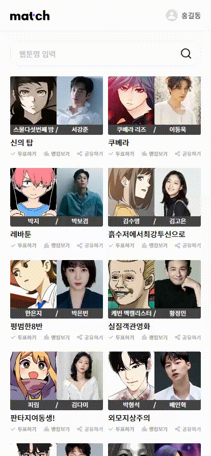
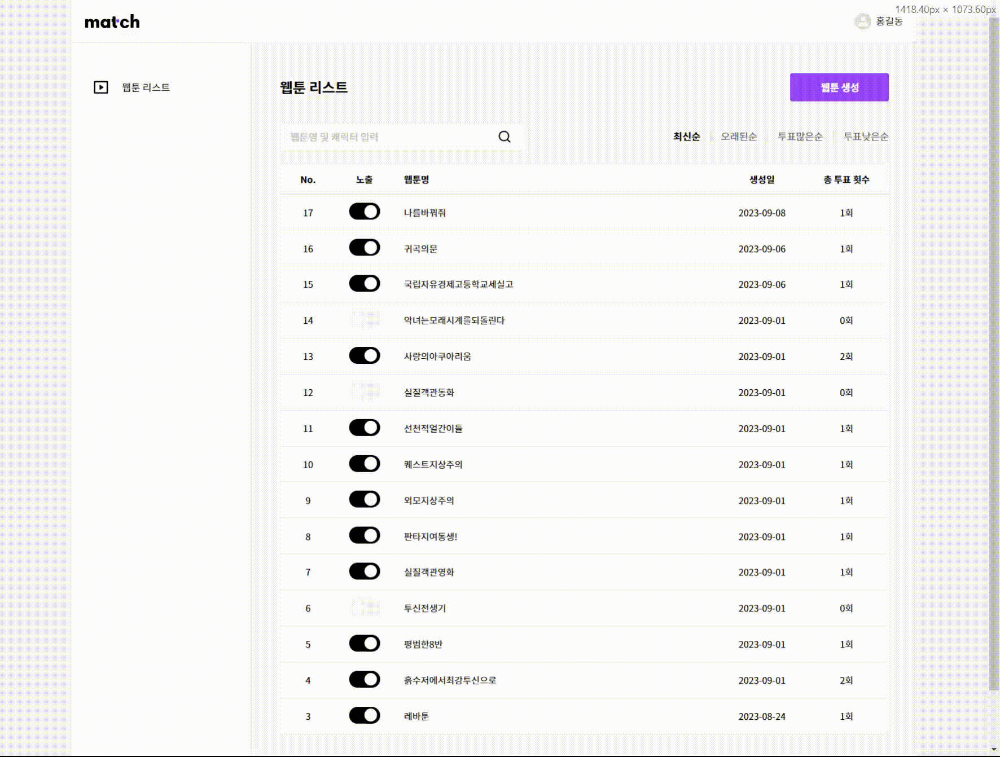
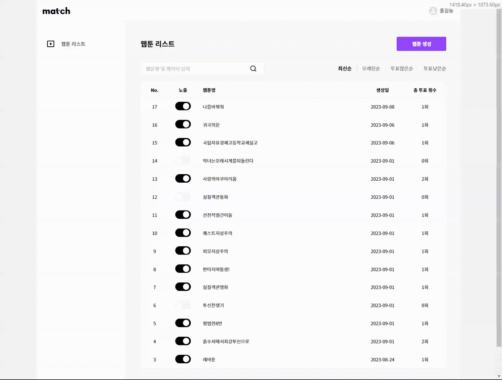

# Match
### [사이트 바로가기](https://www.matchwt.com)

### 💭 이 웹툰 주인공에 ooo 배우가 잘 어울리던데..

내가 좋아하는 웹툰이 드라마화 된다면

당신은 어떤 배우를 캐스팅 하실 건가요?

### ✏️ 원석을 발굴하는 캐스팅 디렉터가 되어볼까요?

직접 캐스팅 디렉터가 되어 배우를 투표해보세요!

나만 알고 있기 아까운 배우도 추천해주세요

 
 

## 📃 소개

> 웹툰 주인공에 맞는 배우를 가상 캐스팅하는 서비스

### 개발기간

2023년 08월 ~ 2023년 09월

### 기술 스택

    
    
    
    
    
    

| 분야           | 사용 기술                           | 비고 |
| -------------- |---------------------------------| ---- |
| FrontEnd       | Nuxt.js, javascript             |
| BackEnd        | Java, SpringBoot, JPA, QueryDSL |
| Database       | Aws RDS, Mysql                  |
| Cloud Services | Aws ec2, Aws loadbalancer       |
| TOOL           | IntelliJ, JetBrains, Notion     |
| DESIGN         | Figma                           |

### 아키텍쳐 구조

    

### 팀원

- **Frontend Developer & Design - [임재희](https://github.com/limjaehee)**
- **Backend Developer - [박지호](https://github.com/Binjiho)**

### 기타

- [팀 노션](https://www.notion.so/a4f860882cc146698d15c5751a4a4978?v=6658d070136b4066bd3f4febaf624ab1&pvs=4)

 
 

## 🛠️ 주요 기능

### 웹툰 검색 기능

> 무한 스크롤을 적용하여 UX에 집중했습니다. 
> 상단 검색바를 통해 웹툰을 검색할 수 있습니다.

### 배우 투표 기능

> 유저가 배우를 직접 입력하여 추가할 수 있으며 기존의 배우에게 투표할 수 있습니다. 
> 투표 후에는 결과값을 바로 볼 수 있고 다른 캐릭터를 투표하도록 유도했습니다.

### 어드민 - 웹툰 관리

> 웹툰을 `최신순`, `오래된순`, `투표많은순`, `투표적은순`으로 정렬할 수 있으며 검색 기능이 있습니다. 
> 해당 웹툰을 `노출`&`비노출` 할 수 있습니다.

### 어드민 - 웹툰 생성

> 웹툰을 크롤링을 통해 생성합니다.  
> 해당 웹툰의 정보와 캐릭터를 가져옵니다.

