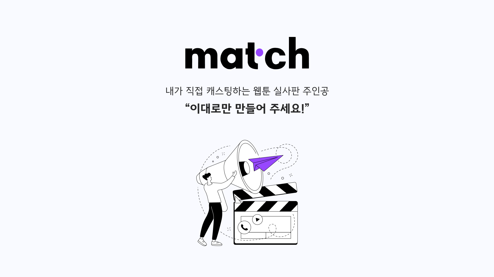

### 💭 이 웹툰 주인공에 ooo 배우가 잘 어울리던데..

내가 좋아하는 웹툰이 드라마화 된다면

당신은 어떤 배우를 캐스팅 하실 건가요?

### ✏️ 원석을 발굴하는 캐스팅 디렉터가 되어볼까요?

직접 캐스팅 디렉터가 되어 배우를 투표해보세요!

나만 알고 있기 아까운 배우도 추천해주세요

## 📃 소개

> 웹툰 주인공에 맞는 배우를 가상 캐스팅하는 서비스

### 개발기간

2023년 07월 31일 ~ 2023년 09월 07일

### 기술 스택

| 분야           | 사용 기술                   | 비고 |
| -------------- | --------------------------- | ---- |
| FrontEnd       | Nuxt.js, javascript         |
| BackEnd        | Java, SpringBoot            |
| Database       | Aws RDS, Mysql              |
| Cloud Services | Aws ec2                     |
| TOOL           | IntelliJ, JetBrains, Notion |
| DESIGN         | Figma                       |

### 팀원

- **Frontend Developer & Design - [임재희](https://github.com/limjaehee)**
- **Backend Developer - [박지호](https://github.com/Binjiho)**

### 참고 링크

- [팀 노션](https://www.notion.so/a4f860882cc146698d15c5751a4a4978?v=6658d070136b4066bd3f4febaf624ab1&pvs=4)

## 🛠️ 주요 기능

### Front - 웹툰 캐릭터에 맞는 배우 추가 및 투표

어쩌구 저쩌구 했다

어쩌구 저쩌구 했다

어쩌구 저쩌구 했다

### Front - 종합 투표 결과 보기

어쩌구 저쩌구 했다

어쩌구 저쩌구 했다

어쩌구 저쩌구 했다

### Front - 웹툰 투표 1위 썸네일 사용

어쩌구 저쩌구 했다

어쩌구 저쩌구 했다

어쩌구 저쩌구 했다

### admin - 웹툰 캐릭터 크롤링하여 생성하기

어쩌구 저쩌구 했다

어쩌구 저쩌구 했다

어쩌구 저쩌구 했다

## 📂 폴더 구조
